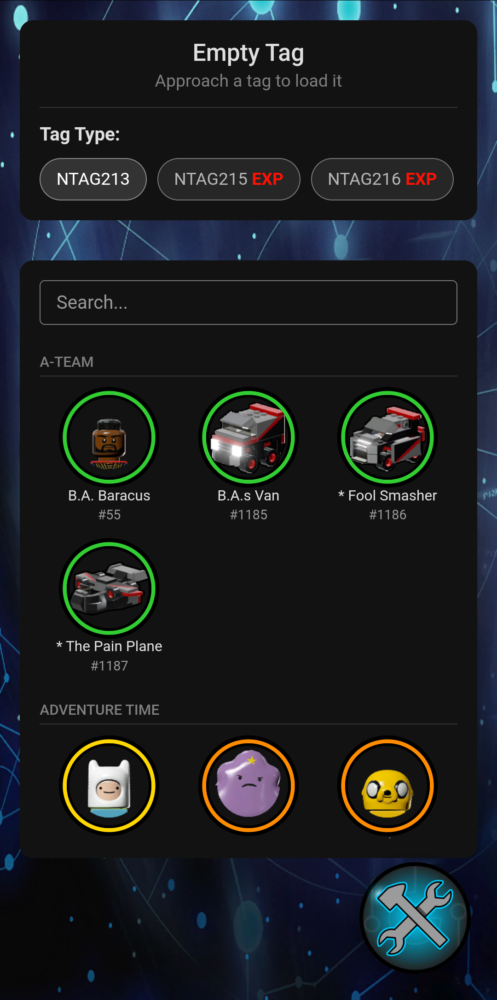
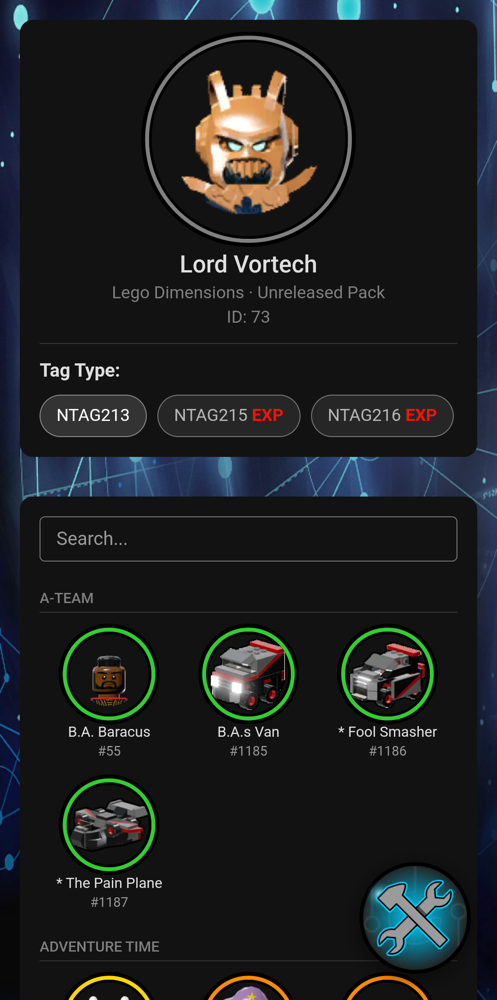
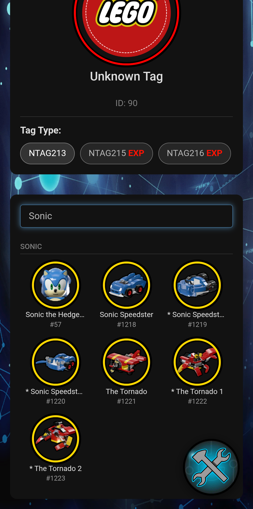

# Lego Dimensions Tag Editor v3

## Main changes
- Removed the native Android Action bar as top bar as it was overlapping with other elements
- Revamped the UI
- Added being able to retrieve the character or vehicle from the scanned tag
- Added being able to create custom tags by assigning an unused ID (useful for modding custom characters)
- Added back the unreleased characters
- Added categories and merged the vehicles and characters into their own franchises
- Support for Android 16 from version by [omer-yalcin](https://github.com/omer-yalcin/ldtageditor)
- Many thanks to the original dev of the app and [naleo](https://github.com/naleo/ldtageditor-v2) for providing the source code

### Some images:

*** 
> forked from https://github.com/omer-yalcin/ldtageditor which was forked from https://github.com/naleo/ldtageditor-v2
### ldtageditor-v2
Lego Dimensions Tag Editor - Updated

This is an update version of the Lego Dimensions Tag Editor.

There was an issue where if an android phone does not provide the MifareUltralight NFC api, the app simply does not work.  I replaced all API calls to this with calls to the NfcA API, which all phones with NFC capability on android are required to support.  This fixes the issues I had with the app.

Added Android 16 support
Added images to selected tags
Added borders to the images to reflect the pack colors
